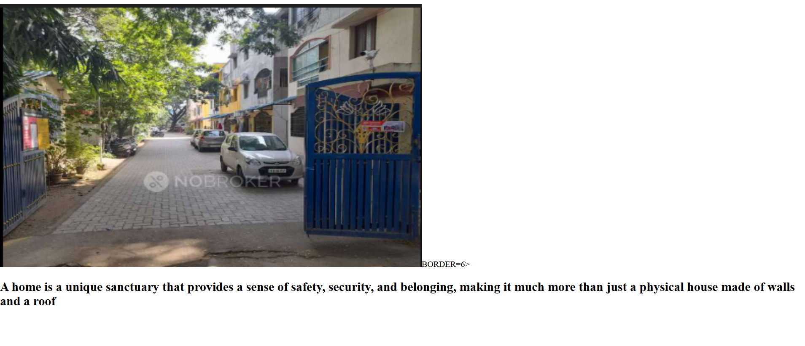
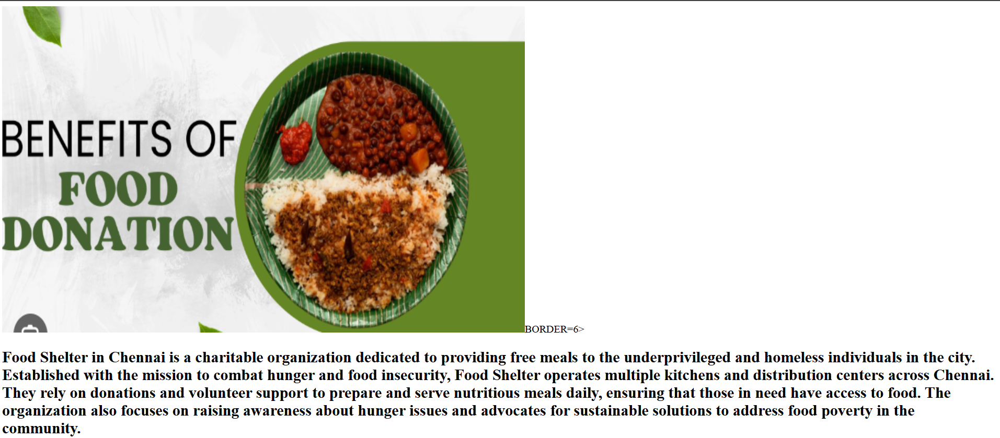
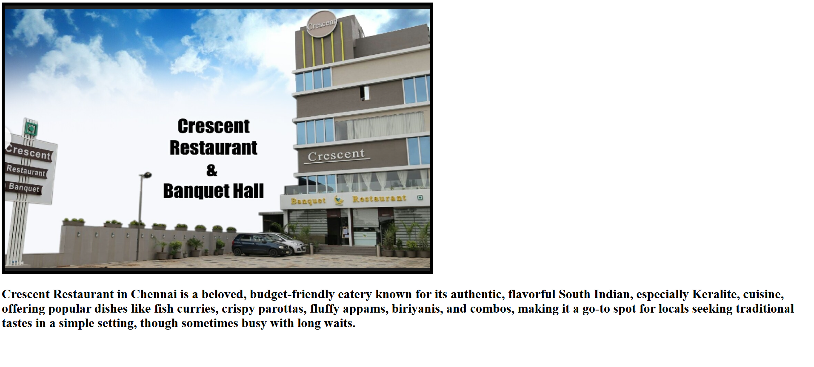

# Ex04 Places Around Me
## Date: 

## AIM
To develop a website to display details about the places around my house.

## DESIGN STEPS

### STEP 1
Create a Django admin interface.

### STEP 2
Download your city map from Google.

### STEP 3
Using ```<map>``` tag name the map.

### STEP 4
Create clickable regions in the image using ```<area>``` tag.

### STEP 5
Write HTML programs for all the regions identified.

### STEP 6
Execute the programs and publish them.

## CODE
```


<map name="image-map">
    <area target="" alt="crescent restaurant" title="crescent restaurant" href="hotel.html" coords="169,315,400,416" shape="rect">
    <area target="" alt="home" title="home" href="house.html" coords="451,157,450,409,639,428,647,182,554,76" shape="poly">
    <area target="" alt="hotel" title="hotel" href="foodshelter.html" coords="827,47,97" shape="circle">
</map>
<!DOCTYPE html>
<html lang="en">
<head>
    <meta charset="UTF-8">
    <meta name="viewport" content="width=device-width, initial-scale=1.0">
    <title>Document</title>
</head>
<body>
    
        <h2>Crescent Restaurant in Chennai is a beloved, budget-friendly eatery known for its authentic, flavorful South Indian, especially Keralite, cuisine, offering popular dishes like fish curries, crispy parottas, fluffy appams, biriyanis, and combos, making it a go-to spot for locals seeking traditional tastes in a simple setting, though sometimes busy with long waits. </h2>
    
</body>
</html>
<!DOCTYPE html>
<html lang="en">
<head>
    <meta charset="UTF-8">
    <meta name="viewport" content="width=device-width, initial-scale=1.0">
    <title>Document</title>
</head>
<body>
    BORDER=6>
        <h2>Food Shelter in Chennai is a charitable organization dedicated to providing free meals to the underprivileged and homeless individuals in the city. Established with the mission to combat hunger and food insecurity, Food Shelter operates multiple kitchens and distribution centers across Chennai. They rely on donations and volunteer support to prepare and serve nutritious meals daily, ensuring that those in need have access to food. The organization also focuses on raising awareness about hunger issues and advocates for sustainable solutions to address food poverty in the community.</h2>
    
</body>
</html>
<!DOCTYPE html>
<html lang="en">
<head>
    <meta charset="UTF-8">
    <meta name="viewport" content="width=device-width, initial-scale=1.0">
    <title>Document</title>
</head>
<body>
    BORDER=6>
        <h2>A home is a unique sanctuary that provides a sense of safety, security, and belonging, making it much more than just a physical house made of walls and a roof</h2>
    
</body>
</html>
```

## OUTPUT





## RESULT
The program for implementing image maps using HTML is executed successfully.
